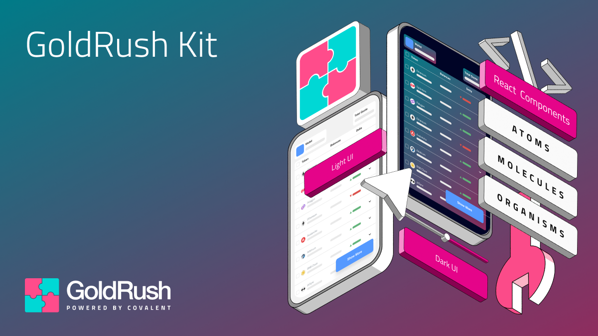

<div align="center">
  <a href="https://goldrush.dev/products/goldrush/"  target="_blank" rel="noopener noreferrer">
    
  </a>

<br/>

[](https://www.npmjs.com/package/@covalenthq/client-sdk)
[](https://github.com/covalenthq/goldrush-kit/blob/main/LICENSE)
[](https://github.com/covalenthq/goldrush-kit/commits/master)
[](https://github.com/covalenthq/goldrush-kit/graphs/contributors)
[](https://github.com/covalenthq/goldrush-kit/issues)
[](https://github.com/covalenthq/goldrush-kit/pulls)
[](https://github.com/covalenthq/goldrush-kit/stargazers)
[](https://github.com/covalenthq/goldrush-kit/network/members)

</div>

<h1 align="center">Beautifully designed React components for your dApp frontend.</h1>

<div align="center">
Powered by the <a href="https://www.npmjs.com/package/@covalenthq/client-sdk">GoldRush TypeScript SDK</a>. Supports 100+ Chains. Open-source. Customizable. 
</div>

## Explore live with Storybook

Explore the GoldRush UI Kit with our [live hosted Storybook](https://goldrush-kit.vercel.app/?path=/story/organisms-nft-collection-view--nft-collection-view).

## Setup

1. [Sign up](https://goldrush.dev/platform/auth/register) for a free GoldRush API key to get started with the GoldRush UI Kit.

2. Install `goldrush-kit` using `npm` or `yarn`:

    ```bash
    npm install @covalenthq/goldrush-kit
    ```

    or

    ```bash
    yarn add @covalenthq/goldrush-kit
    ```

## Implementation

1.  Import `GoldRushProvider`

    ```tsx
    import { GoldRushProvider } from "@covalenthq/goldrush-kit";
    ```

2.  Wrap `GoldRushProvider` around the application and set the GoldRush API key prop.

    > **Note:** You should always keep your API key private, never put it directly into your code, especially frontend code. Instead, use an environment variable to inject the key into your code.

    ```tsx
    import { GoldRushProvider } from "@covalenthq/goldrush-kit";

    const GoldRushExample = () => {
        return (
            <GoldRushProvider
                apikey={process.env.NEXT_PUBLIC_API_KEY}
            ></GoldRushProvider>
        );
    };

    export default GoldRushExample;
    ```

3.  Add the stylesheet and custom theme.

    ```tsx
    import { GoldRushProvider } from "@covalenthq/goldrush-kit";
    import "@covalenthq/goldrush-kit/styles.css";

    const GoldRushExample = () => {
        return (
            <GoldRushProvider
                apikey={process.env.NEXT_PUBLIC_API_KEY}
                theme={{
                    borderRadius: 6,
                    colors: {
                        dark: {
                            primary: "#FF4C8B",
                            background: "#000426",
                            foreground: "#FFFFFF",
                            secondary: "#868E96",
                        },
                        light: {
                            primary: "#00D8D5",
                            background: "#FFFFFF",
                            foreground: "#1C2024",
                            secondary: "#868E96",
                        },
                    },
                    mode: "dark",
                }}
            ></GoldRushProvider>
        );
    };

    export default GoldRushExample;
    ```

4.  Import and configure the desired components.

        > **Note:** If you're using `next.js` versions `^13.0` with the `app` router, make sure you have `use client;` at the top of the file to disable Next's server component modules.

        ```tsx
        import { GoldRushProvider, TokenBalancesList } from "@covalenthq/goldrush-kit"
        import "@covalenthq/goldrush-kit/styles.css";

        const GoldRushExample = () => {
            return (
                <GoldRushProvider
                    apikey={process.env.NEXT_PUBLIC_API_KEY}
                    theme={{
                        borderRadius: 6,
                        colors: {
                            dark: {
                                primary: "#FF4C8B",
                                background: "#000426",
                                foreground: "#FFFFFF",
                                secondary: "#868E96",
                            },
                            light: {
                                primary: "#00D8D5",
                                background: "#FFFFFF",
                                foreground: "#1C2024",
                                secondary: "#868E96",
                            },
                        },
                        mode: "dark",
                    }}
                >
                  <TokenBalancesList
                      chain_names={[
                          "eth-mainnet",
                          "matic-mainnet",
                          "bsc-mainnet",
                          "avalanche-mainnet",
                          "optimism-mainnet",
                      ]}
                      hide_small_balances
                      address="0xfc43f5f9dd45258b3aff31bdbe6561d97e8b71de"
                  />
                </GoldRushProvider>
            );
        };

        export default GoldRushExample;
        ```

    Using the example above should render a component similar to [this](https://goldrush-kit.vercel.app/iframe.html?args=chain_names[2]:!undefined;address:0xfc43f5f9dd45258b3aff31bdbe6561d97e8b71de;hide_small_balances:!true&globals=&id=molecules-token-token-balances-list--token-balances-list&viewMode=story).

## GoldRush UI Templates

| Name                                                                                | Description                                                                                        |                                                                        |                                                                                                                                                                                     |
| ----------------------------------------------------------------------------------- | -------------------------------------------------------------------------------------------------- | ---------------------------------------------------------------------- | ----------------------------------------------------------------------------------------------------------------------------------------------------------------------------------- |
| [Block Explorer UI](https://github.com/covalenthq/goldrush-block-explorer-ui)       | A cross chain block explorer kit that can be customized.                                           | [View live template](https://goldrush-block-explorer-ui.vercel.app/)   | [](https://github.com/covalenthq/goldrush-block-explorer-ui/commits/main)     |
| [Wallet & Portfolio UI](https://github.com/covalenthq/goldrush-wallet-portfolio-ui) | Helps web3 developers easily display tokens and NFTs held by a wallet across multiple blockchains. | [View live template](https://goldrush-wallet-portfolio-ui.vercel.app/) | [](https://github.com/covalenthq/goldrush-wallet-portfolio-ui/commits/main) |
| [NFT Gallery UI](https://github.com/covalenthq/goldrush-nft-gallery-ui)             | Display NFTs along with metadata. Build web3 NFT galleries using React components.                 | [View live template](https://goldrush-nft-gallery-ui.vercel.app/)      | [](https://github.com/covalenthq/goldrush-nft-gallery-ui/commits/main)           |
| [Transaction Receipt UI](https://github.com/covalenthq/goldrush-tx-receipt-ui)      | Get a beautifully rendered and detailed view of blockchain transactions.                           | [View live template](https://goldrush-tx-receipt-ui.vercel.app/)       | [](https://github.com/covalenthq/goldrush-tx-receipt-ui/commits/main)             |

## Build and customize with Storybook locally

The components used above are built with `ReactJS` and `TailwindCSS`, using `TypeScript`. You can preview and customize the components using [Storybook](https://storybook.js.org/).

1. **Setup Environmental Variables**: Create and add a `.env` file to the root directory of your project and the listed values from [.env.example](./.env.example) following to the file.

    ```
    STORYBOOK_GOLDRUSH_API_KEY = "<YOUR_API_KEY>"
    ```

2. **Start development server**

    ```bash
    npm run dev
    ```

3. **Build/Bundle Component Library**

    ```bash
    npm run build:library
    ```

4. **Build/Bundle Storybook**

    ```bash
    npm run build:storybook
    ```

## Contributing

Contributions, issues and feature requests are welcome!
Feel free to check [issues](https://github.com/covalenthq/goldrush-kit/issues) page.

## Show your support

Give a ⭐️ if this project helped you!

## License

This project is [MIT](./LICENSE) licensed.
